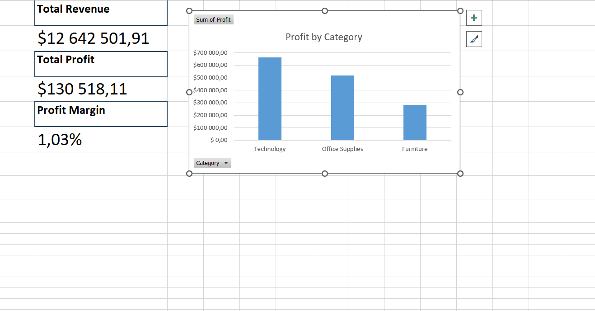

# Global Superstore Sales Dashboard

## Overview
This project analyzes sales performance using the Global Superstore dataset.
The Excel dashboard focuses on key business KPIs and profitability by category.

## Tools Used
- Excel (PivotTables, KPI reporting, charts)

## Key Metrics
- Total Revenue
- Total Profit
- Profit Margin
- Profit by Category

## Dashboard Preview

## Insights
- Technology is the most profitable category
- Office Supplies follows closely behind
- Furniture generates the lowest profit
- Overall profit margin is approximately 1%

## Files
- excel/Global_Superstore_Sales_Dashboard.xlsx

